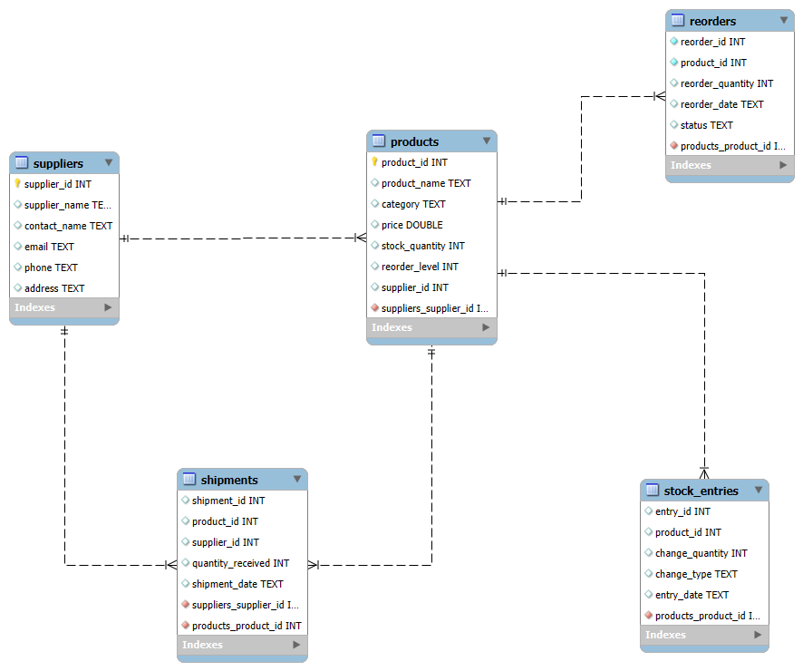

# 📦 Inventory Management System
### Full-Stack Application | Streamlit + Python + MySQL


---

# 📝 Problem Statement

Many small and medium businesses struggle with:

- ❌ Manual inventory tracking  
- ❌ Stock shortages or overstocking  
- ❌ No centralized sales tracking  
- ❌ Delayed reorder processing  
- ❌ No real-time dashboard visibility  

Businesses need a **centralized and automated system** that can:

- Track products and suppliers
- Monitor stock levels in real time
- Record sales and restocking
- Automate reorder workflows
- Provide analytical insights through dashboards

This project solves these challenges by building a **Full-Stack Inventory Management System**.

---

# 🚀 Project Overview

This system was developed using:

- **Python** for backend logic
- **MySQL** for relational database management
- **Streamlit** for the interactive web interface

The application manages the **complete inventory lifecycle**, from supplier shipments to sales and reorder management.

---

# 🎥 Application Demo

Below is a short demo of the Inventory Management System built with **Streamlit + Python + MySQL**.


---

### Key Features

- 📦 Product Management  
- 🏢 Supplier Management  
- 📊 Inventory Tracking  
- 🔁 Automated Reorder System  
- 💰 Sales & Restock Analytics  
- 📈 Interactive Dashboard  

---

# 🛠 Tech Stack

## Frontend
- **Streamlit**
  - Interactive dashboard
  - Form-based data entry
  - Real-time inventory visualization

## Backend
- **Python**
  - Business logic
  - Modular architecture
  - Authentication handling
  - Data processing

## Database
- **MySQL**
  - Relational schema design
  - Foreign key relationships
  - Stored procedures
  - Views
  - Transaction-safe operations

## Libraries

- `streamlit`
- `mysql-connector-python`
- `pandas`
- `bcrypt`

---


# 🗺 Database Architecture (ER Diagram)

Below is the Entity Relationship Diagram representing the database structure.



---

# 🔎 Relationship Explanation

### 🏢 suppliers
Primary Key: `supplier_id`

One supplier can supply multiple products.

Connected tables:
- `products`
- `shipments`

---

### 📦 products
Primary Key: `product_id`

Foreign Key: `supplier_id`

A product can have:

- Multiple shipments
- Multiple stock entries
- Multiple reorders

---

### 🚚 shipments
Primary Key: `shipment_id`

Foreign Keys:

- `product_id`
- `supplier_id`

Tracks incoming stock from suppliers.

---

### 📊 stock_entries
Primary Key: `entry_id`

Foreign Key: `product_id`

Tracks inventory changes:

- Sales (negative quantity)
- Restocks (positive quantity)

---

### 🔁 reorders
Primary Key: `reorder_id`

Foreign Key: `product_id`

Tracks reorder lifecycle:

- Ordered
- Received

---

# 🔗 Relationship Summary

- **One Supplier → Many Products**
- **One Supplier → Many Shipments**
- **One Product → Many Shipments**
- **One Product → Many Stock Entries**
- **One Product → Many Reorders**

This relational structure ensures:

✔ Data consistency  
✔ Referential integrity  
✔ Transaction-safe inventory updates  
✔ Scalable database design  

---

# 🔐 Security & Utility Layer

To improve security and maintainability, the system includes a dedicated security and utility layer.

---

## 🛡 Authentication System

Authentication is implemented using:

- `bcrypt` password hashing
- Session management using `st.session_state`
- Unique username enforcement
- Role-Based Access Control (RBAC)

### Authentication Features

- User **Sign Up**
- Secure **Login**
- **Logout functionality**
- Password hashing
- Role assignment (`Admin`, `Manager`)

---

## 🔒 Password Security

Passwords are never stored in plain text.

The system uses secure hashing:

```python
bcrypt.hashpw()
bcrypt.checkpw()

```

## 🧑‍💻 Author

**Sourav Raj**  
Data Scientist | Data Analyst

Feel free to connect on LinkedIn or explore my other projects.

🔗 LinkedIn: https://www.linkedin.com/in/sourav664